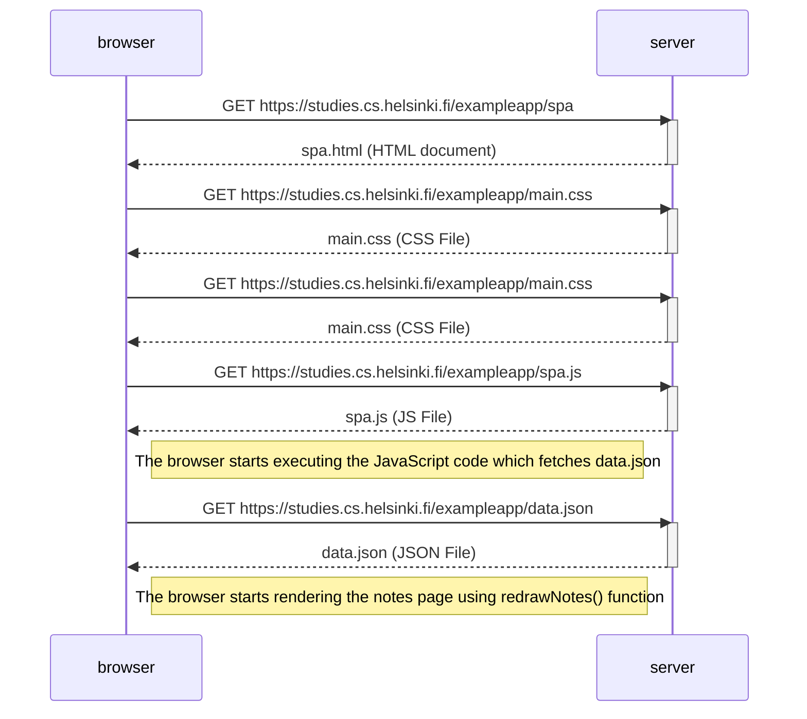

SPA app sequence diagram:

```mermaid
sequenceDiagram
    participant browser
    participant server

    browser->>server: GET  https://studies.cs.helsinki.fi/exampleapp/spa
    activate server
    server-->>browser: spa.html (HTML document)
    deactivate server

    browser->>server: GET  https://studies.cs.helsinki.fi/exampleapp/main.css
    activate server
    server-->>browser: main.css (CSS File)
    deactivate server

    browser->>server: GET  https://studies.cs.helsinki.fi/exampleapp/main.css
    activate server
    server-->>browser: main.css (CSS File)
    deactivate server

    browser->>server: GET  https://studies.cs.helsinki.fi/exampleapp/spa.js
    activate server
    server-->>browser: spa.js (JS File)
    deactivate server

    Note right of browser: The browser starts executing the JavaScript code which fetches  data.json

    browser->>server: GET  https://studies.cs.helsinki.fi/exampleapp/data.json
    activate server
    server-->>browser: data.json (JSON File)
    deactivate server

    Note right of browser: The browser starts rendering the notes page using redrawNotes() function
```