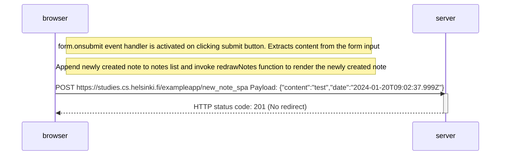

Sequence Diagram for adding note in SPA app

```mermaid
sequenceDiagram
    participant browser
    participant server

    Note right of browser: form.onsubmit event handler is activated on clicking submit button. Extracts content from the form input

    Note right of browser: Append newly created note to notes list and invoke redrawNotes function to render the newly created note 

    browser->>server: POST https://studies.cs.helsinki.fi/exampleapp/new_note_spa Payload: {"content":"test","date":"2024-01-20T09:02:37.999Z"}
    activate server
    server-->>browser: HTTP status code: 201 (No redirect)
    deactivate server
```